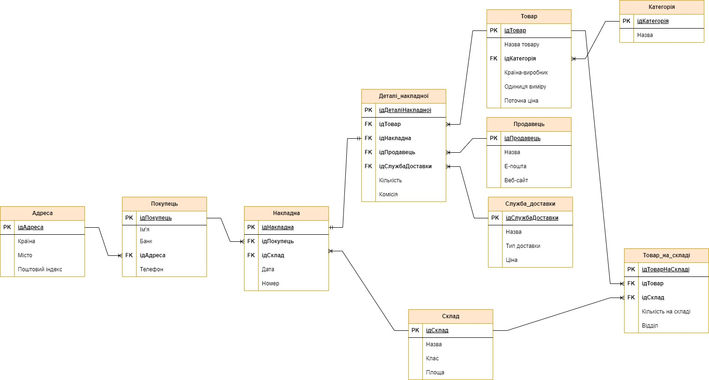
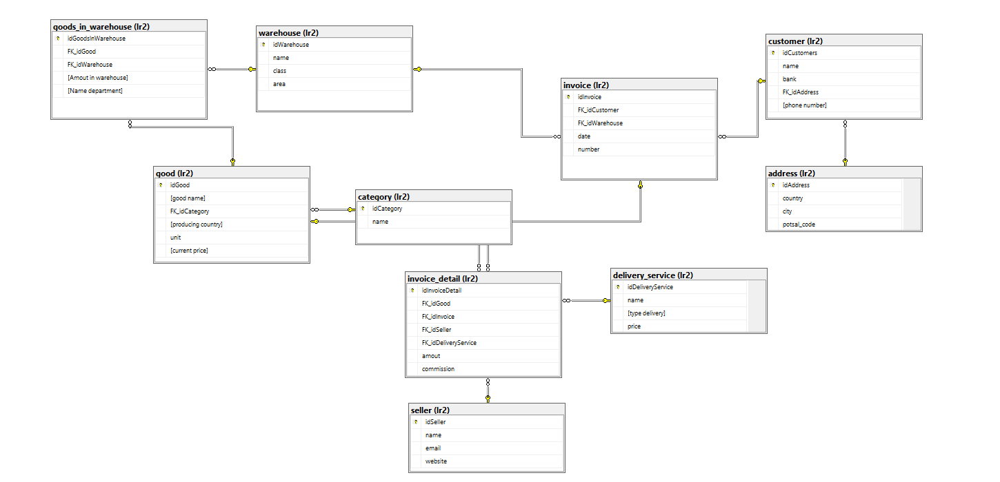

# CourseDataBase
CourseDataBase — курсовий проєкт, метою якого є розробка настільного додатку Windows для роботи з реляційною базою даних онлайн-магазину товарів.
## Table of Contents
* [General Info](#general-information)
* [Technologies Used](#technologies-used)
* [Features](#features)
* [Screenshots](#screenshots)
* [Project Status](#project-status)
<!-- * [License](#license) -->
## General Information
- ER (Entity-Relationship) модель бази даних

- Діаграма бази даних із середовища SQL Server Management Studio

## Technologies Used
- .NET Framework - version 4.7.2
- Microsoft.ReportingServices.ReportViewerControl.Winforms - version 150.1586.0
- Microsoft.SqlServer.Types - version 14.0.314.76

## Features
CourseDataBase має наступні функції:
- відображення та редагування (додавання, видалення та збереження) для рядків даних кожної таблиці;
- створення звітної інформації (у вигляді таблиці та оформленого звіту).

## Screenshots
<!--  -->
- Головна форма — меню з вибором таблиць бази даних.

- Форма таблиці товарів — містить таблицю з даними, панель керування та кнопку для створення звітної інформації.

- Форма звіту для товарів — містить таблицю-звіт та спеціальний звіт.

- Звіт для таблиці товарів, експортований у форматі excel.

## Project Status
Проєкт завершено 25 грудня 2023 року.
